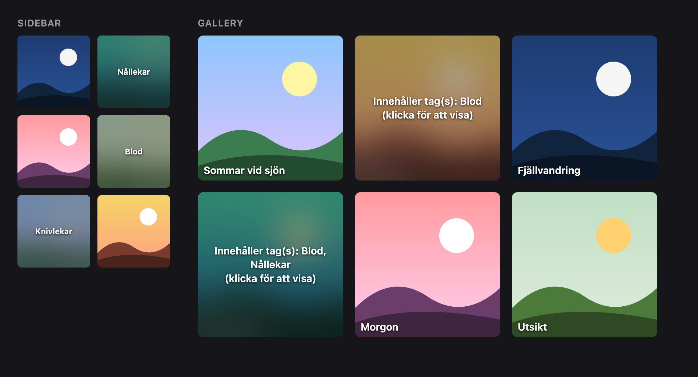
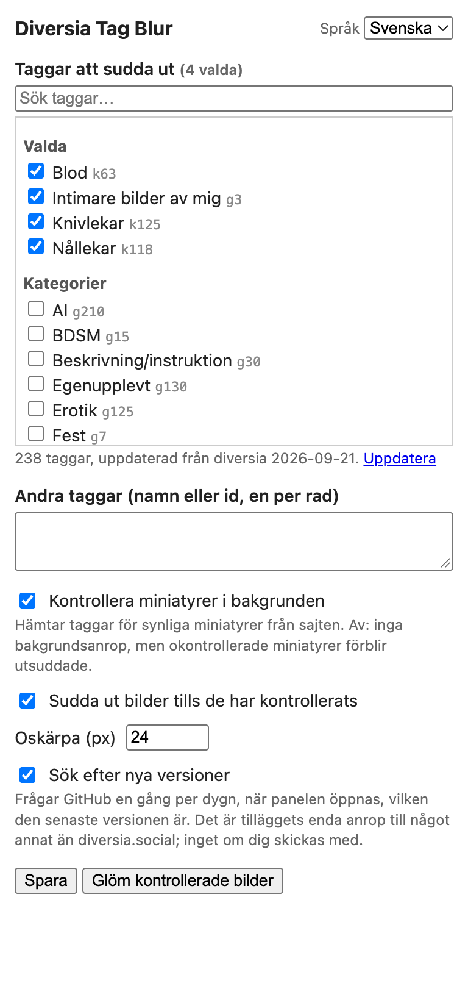

# Diversia Tag Blur

🇬🇧 [English](README.en.md)

> **GenAI-projekt.** Koden, dokumentationen och bilderna i det här repot är framtagna
> med generativ AI (Claude). Ingen korrekturläsning eller oberoende granskning har
> gjorts. Använd efter eget omdöme.

Ett Chrome-tillägg som suddar ut bilder på [diversia.social](https://diversia.social)
som har taggar du väljer. Utsuddade bilder visar vilka taggar som matchade, och ett
klick visar bilden.

Demosida med påhittade bilder. Överlägget och texterna är tilläggets riktiga CSS.

## Installation

Tillägget finns inte i Chrome Web Store, utan installeras "uppackat".

> **Chrome Web Store:** jag har i dagsläget ingen avsikt att publicera tillägget i
> Chrome Web Store. Installera det enligt stegen nedan.

1. Ladda ner senaste `Chrome-Diversia-Tagblur-x.y.z.zip` från
   [Releases](https://github.com/JanJoh/Chrome-Diversia-Tagblur/releases) och packa upp
   den (eller `git clone` det här repot).
2. Öppna `chrome://extensions` och slå på **Utvecklarläge** (uppe till höger).
3. Klicka på **Läs in okomprimerat tillägg** och välj den uppackade mappen (den som
   innehåller `manifest.json`).
4. Valfritt: fäst tillägget via pusselbitsikonen i verktygsfältet.

Fungerar i alla Chromium-webbläsare med stöd för Manifest V3 (Chrome, Edge, Brave, Vivaldi).

**Uppdatera:** ersätt mappen med den nya versionen och klicka på ladda om-pilen på
tilläggets kort i `chrome://extensions`.

## Användning

### 1. Välj taggar

Klicka på tilläggets ikon. Panelen är på svenska som standard; byt med
**Språk / Language** uppe till höger.

Tagglistan (kategorier och taggar, runt 240 stycken) är **inbyggd**, så den finns där
från första klicket. När du öppnar panelen och är inloggad på diversia uppdateras listan
från sajten i bakgrunden (högst en gång per dygn; **Uppdatera** tvingar fram det).

- **Sök** för att filtrera listan och **kryssa i** taggarna som ska suddas ut. Ikryssade
  taggar visas under *Valda* högst upp.
- **Andra taggar:** taggar som inte finns i listan, med namn (`Latex/gummi`) eller id
  (`k40`), en per rad. Id:t är det som står efter `?tag=` i en tagglänk.
- **Kontrollera miniatyrer i bakgrunden** (på som standard): hämtar taggarna för
  miniatyrer du ser. Läs [Bakgrundskontroller](#bakgrundskontroller) innan du bestämmer dig.
- **Sudda ut bilder tills de har kontrollerats** (på som standard): miniatyrer är
  utsuddade från början och visas när deras taggar är kända, så en taggad bild syns
  aldrig ens för ett ögonblick.
- **Oskärpa (px):** hur mycket bilden suddas.
- **Sök efter nya versioner** (på som standard): frågar GitHub en gång per dygn om det
  finns en nyare version, och visar i så fall en rad högst upp i panelen. Se
  [Versionskontroll](#versionskontroll).
- **Spara.** Öppna diversia-flikar uppdateras direkt.
- **Glöm kontrollerade bilder** tömmer cachen med kontrollerade bilder (se nedan).

### 2. Surfa

- Matchande bilder täcks av en oskärpa och en text:
  **Innehåller tag(s): Blod, Nållekar (klicka för att visa)**.
  Små miniatyrer (som i galleriets sidopanel) visar bara taggnamnen.
- **Klicka en gång** för att visa bilden, och en gång till för att öppna den som vanligt.
- Håll muspekaren över bilden för att se samma text som verktygstips.

## Så fungerar det

| Sida | Var taggarna hämtas |
|---|---|
| Enskild bild (`/pic/?bild=…`) | Läses direkt från sidan. |
| Galleri för en tagg du blockerat (`/pic/?tag=…`) | Alla miniatyrer har taggen, så alla suddas ut utan fler uppslag. |
| Flödet, andra gallerier, sidopanelen | Miniatyrerna saknar taggar. Tillägget hämtar varje bilds taggar i bakgrunden (se nedan). |

Resultaten sparas per bild i 30 dagar, så ett återbesök kostar ingenting. Bilder du
själv öppnar kontrolleras direkt från sidan utan extra anrop.

## Bakgrundskontroller

Översiktssidor (flödet, gallerier, sidopanelen) visar inte bildernas taggar, så tillägget
hämtar taggarna för de miniatyrer du ser från sajten i bakgrunden.

Att använda bakgrundskontroller sker **på egen risk**, och det kan strida mot sajtens regler.

> Stänger du av **Kontrollera miniatyrer i bakgrunden** görs inga anrop i bakgrunden,
> men då **kan alla foton på översiktssidor visas utsuddade**: okontrollerade miniatyrer
> förblir utsuddade (med *Sudda ut bilder tills de har kontrollerats* på), och bara bilder
> du själv öppnar kontrolleras. Stänger du även av den inställningen visas okontrollerade
> miniatyrer som vanligt, utan filtrering.

Profilbilden och sidhuvudets bild har inga taggar och suddas aldrig ut.

## Versionskontroll

Tillägget installeras uppackat och uppdaterar sig inte självt, så det frågar i stället
GitHub om det finns en nyare version. När du öppnar panelen, och senast dygnet innan,
hämtas den senaste utgåvans versionsnummer från
`https://api.github.com/repos/JanJoh/Chrome-Diversia-Tagblur/releases/latest`
och jämförs med den installerade versionen. Är den nyare visas en rad högst upp i
panelen med en länk till [Releases](https://github.com/JanJoh/Chrome-Diversia-Tagblur/releases);
annars syns ingenting. Misslyckas anropet står det ingenting om det, och nästa försök
sker tidigast ett dygn senare.

Anropet skickar inga kakor och inga egna huvuden, och innehåller inget om dig, dina
taggar eller vad du har tittat på — bara en förfrågan om det senaste versionsnumret.
GitHub ser förstås, som varje webbserver, din IP-adress. Stäng av **Sök efter nya
versioner** i panelen så görs anropet inte alls; då får du uppdatera manuellt genom att
titta på Releases-sidan.

## Integritet

- Allt stannar i din webbläsare. Inställningarna sparas i Chromes synkade lagring,
  cachen och tagglistan i lokal lagring.
- Tillägget körs bara på `diversia.social` och pratar bara med `diversia.social` — med
  ett undantag: en återkommande kontroll av om det finns en ny version, högst en gång
  per dygn, mot GitHubs API. Den kan stängas av, och ingenting om dig skickas med. Se
  [Versionskontroll](#versionskontroll).
- Ingen statistik. Inga andra externa anrop än versionskontrollen ovan.
- Sajtens skydd mot högerklick och nedladdning lämnas orört. Tillägget lägger bara en
  CSS-oskärpa över de element som visar bilder.

## Om det slutar fungera

Tillägget är beroende av hur diversias sidor är uppbyggda. Om sajten ändras är det här
ställena att titta på (`content.js`, `blur.css`):

| Vad | Selektor |
|---|---|
| Miniatyr | `a[href*="bild="]` med bakgrundsstil eller en `` inuti |
| Huvudbild | den `img.picshadow` som *inte* ligger i en `bild=`-länk (sidopanelens miniatyrer har samma klass) |
| Taggar på en bildsida | `a[href*="/pic/?tag="]` i samma `.row` som huvudbilden |
| Hela tagglistan | `.gcats2 a[href*="tag="]` på gallerisidor |

Ärenden och pull requests är välkomna.

## Utveckling

Inget byggsteg: ändra filerna och ladda om tillägget i `chrome://extensions`.
`./package.sh` bygger en zip för release med bara de filer tillägget behöver.

## Licens

[MIT](LICENSE). Ej knutet till eller godkänt av diversia.social.
